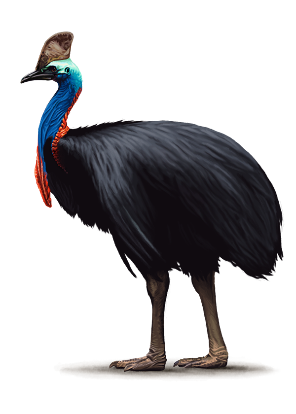

case-sowary-converter (csc)
===
convert cases of a string
___


### To convert a string:
`csc [command] MY_STRING_TO_CONVERT`

### Example:
```bash
csc camal My_String_To_Convert

myStringToConvert
```

### Development uses [Mage](https://magefile.org/)
To list target options:

`go run mage.go -l` or `mage -l`

### [Roadmap](https://github.com/mike-seagull/csc/projects/2)